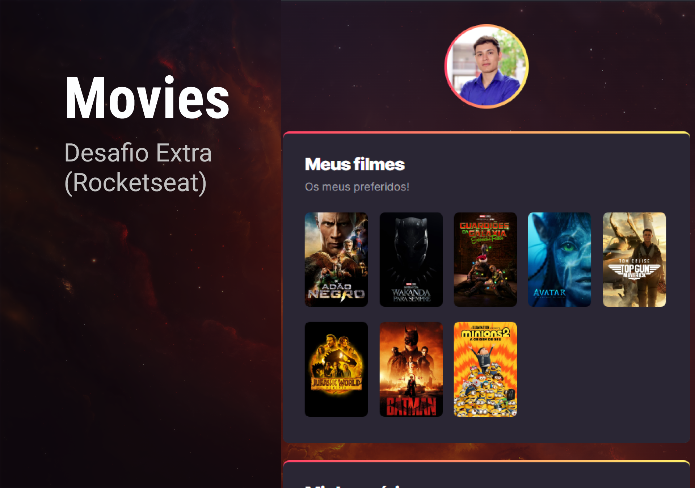

# Movies


> O projeto foi desenvolvido com a finalidade de mostrar meu filmes e series favoritos de uma forma mais dinamica e divertida.

### Futuras Implementações

O projeto ainda está em desenvolvimento e as próximas atualizações serão voltadas nas seguintes tarefas:

- [x] Separar os dados em um arquivo JSON. 
- [x] Dexiar responsivo e acessivel a todos os dispositivos.
- [x] Implementar o frameword React.js.
- [ ] Implementar um painel para gerencialmento dos filmes e series.

## 🚀 Instalando o projeto

Para instalar o Movies, siga estas etapas:

Para clonar o projeto, use o comando:
```
git clone  https://github.com/dev-bragask/movies.git
```

Para instalar as dependências do projeto:
```
npm install
```

## ☕ Usando o projeto

Para rodar o projeto na sua maquina, siga estas etapas:

```
npm start
```

Logo apos acesse o seu navegador que o projeto vai estar rodando em http://localhost:3000 na sua maquina.

## 📝 Licença

Esse projeto está sob licença. Veja o arquivo [LICENÇA](LICENSE.md) para mais detalhes.

[⬆ Voltar ao topo](#movies)<br>